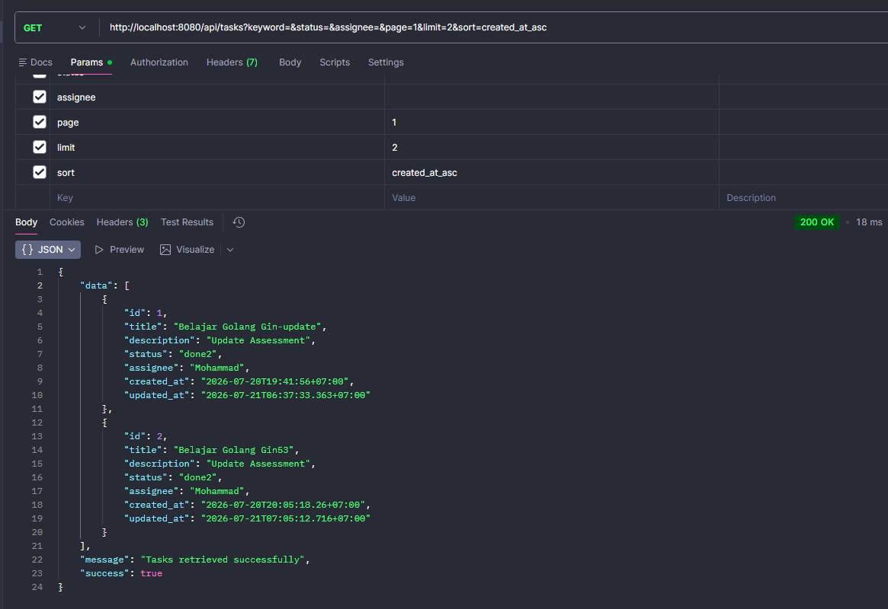
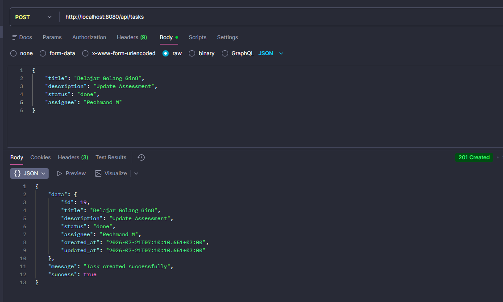
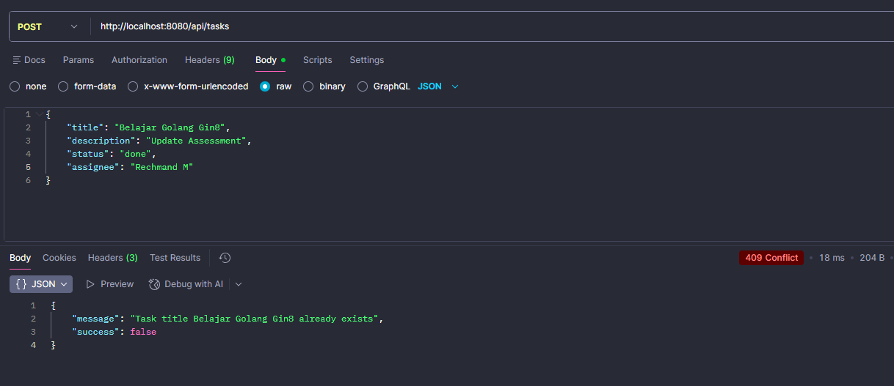
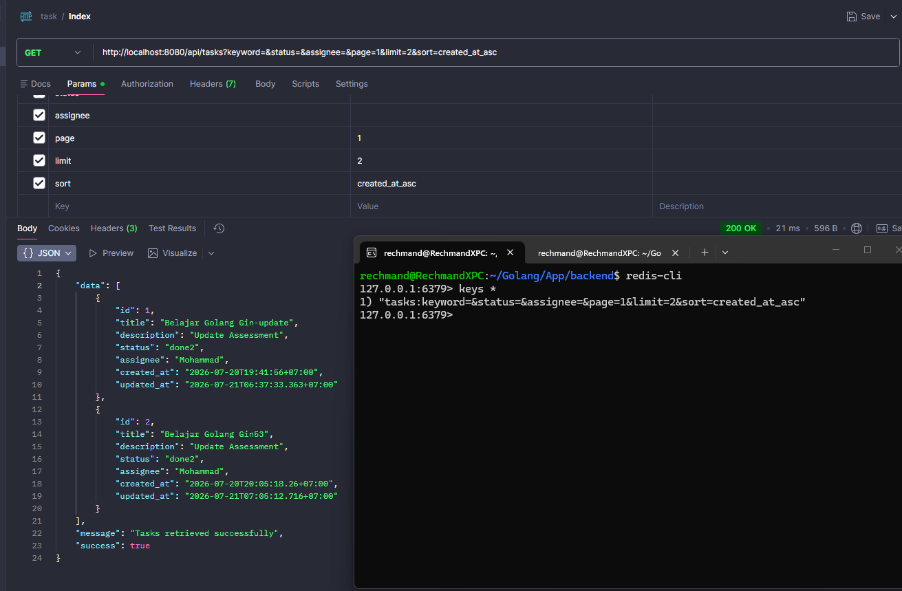

# Task Management API

A RESTful Task Management API built with Go (Gin), GORM, MySQL, and Redis.

This project was developed as part of a Full Stack Engineer technical assessment.

---

## Tech Stack

- Go 1.25+
- Gin Web Framework
- GORM
- MySQL
- Redis
- Air (Hot Reload)

---

## Features

### Backend
- Create Task
- Get Task Detail
- Update Task
- Soft Delete Task
- Search by keyword
- Filter by status
- Filter by assignee
- Pagination
- Sorting
- Consistent JSON Response
- Duplicate Title Validation (HTTP 409)

### Redis
- Cache GET `/api/tasks` for 60 seconds
- Cache key based on query parameters
- Automatic cache invalidation after Create, Update and Delete

### Database
- Auto Migration using GORM

---

## Project Structure

```
.
├── cmd/
│   └── main.go
├── config/
├── controllers/
├── middleware/
├── models/
├── repository/
├── routes/
├── tests/
├── utils/
├── .env
├── go.mod
└── README.md
```

---

## Installation

### 1. Clone Repository

```bash
git clone https://github.com/RechmandM/task-management.git

cd task-management
```

---

### 2. Install Dependencies

```bash
go mod tidy
```

---

### 3. Create .env

Example:

```env
APP_NAME=Task Management

DB_HOST=127.0.0.1
DB_PORT=3306
DB_NAME=task_management
DB_USER=root
DB_PASS=password

REDIS_HOST=127.0.0.1
REDIS_PORT=6379
```

---

### 4. Run MySQL & Redis

Make sure MySQL and Redis are running.

---

### 5. Run Application

Using Go

```bash
go run cmd/main.go
```

or using Air

```bash
air
```

Application will run at

```
http://localhost:8080
```

---

## Database Migration

This project uses **GORM AutoMigrate**.

The database schema is automatically created when the application starts.

```go
DB.AutoMigrate(&models.Task{})
```

---

## API Endpoints

### Get All Tasks

```
GET /api/tasks
```

Query Parameters

| Parameter | Description |
|-----------|-------------|
| keyword | Search by title or description |
| status | Filter by status |
| assignee | Filter by assignee |
| page | Pagination page |
| limit | Number of records |
| sort | id asc/desc |

Example

```
GET /api/tasks?keyword=bug&status=pending&page=1&limit=10&sort=id desc
```

---

### Get Task Detail

```
GET /api/tasks/{id}
```

---

### Create Task

```
POST /api/tasks
```

Example Body

```json
{
    "title":"Learn Go",
    "description":"Study Gin Framework",
    "status":"Pending",
    "assignee":"Rechmand"
}
```

---

### Update Task

```
PUT /api/tasks/{id}
```

---

### Delete Task

```
DELETE /api/tasks/{id}
```

Soft Delete using GORM.

---

## Response Format

### Success

```json
{
    "success": true,
    "message": "Success",
    "data": {}
}
```

### Error

```json
{
    "success": false,
    "message": "Error Message"
}
```

---

## Redis Cache

Cache Duration

```
60 Seconds
```

Cache Key

```
tasks:keyword=...
```

Cache will be automatically invalidated after

- Create
- Update
- Delete

---

## API Testing

### Get Tasks



### Create Task



### Duplicate Title Validation (HTTP 409)



### Redis Cache



---

## Author

**Mohammad Nurrahman**  
Full Stack Software Engineer

- GitHub: https://github.com/RechmandM
- Portfolio: https://www.rechmand.id